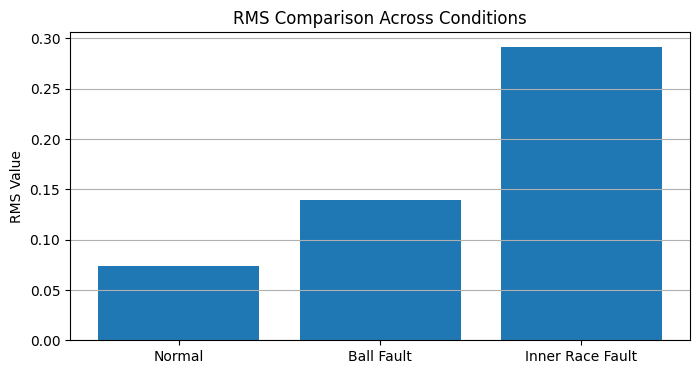
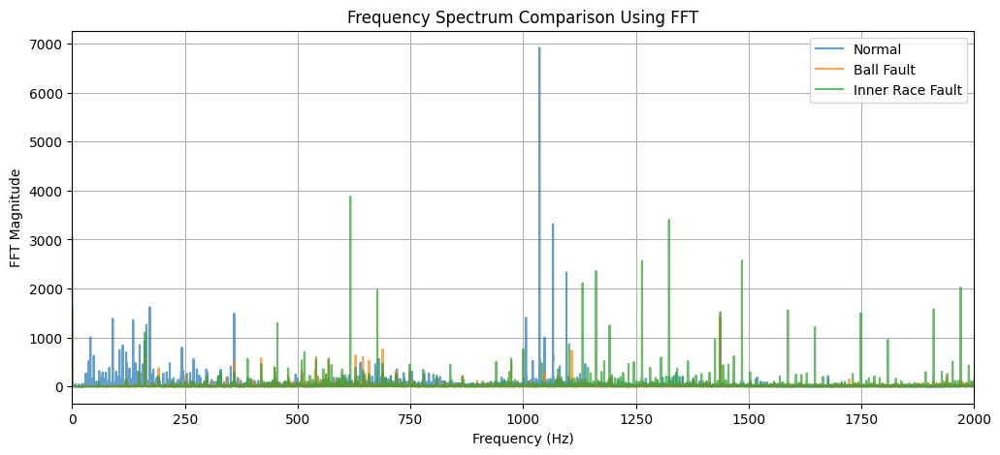
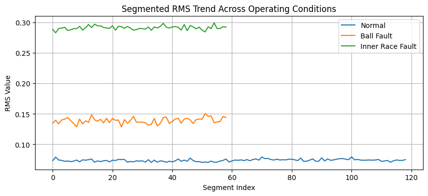
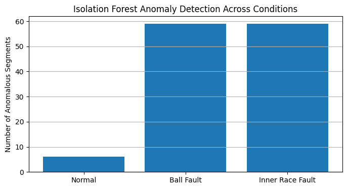

# Vibration-Based Condition Monitoring and Anomaly Detection

## Overview

This project presents a vibration-based condition monitoring framework for identifying abnormal operating conditions in rotating machinery using signal processing and machine-learning-assisted anomaly detection techniques.

The analysis utilizes data from the Case Western Reserve University (CWRU) Bearing Data Center and evaluates vibration behavior under normal, ball fault, and inner race fault conditions. The project demonstrates methodologies commonly used in predictive maintenance and condition-monitoring applications.

---

## Objectives

The primary objectives of this project were to:

- Analyze vibration measurements from rotating machinery
- Extract condition indicators from sensor data
- Compare healthy and fault-related operating conditions
- Apply frequency-domain analysis using Fast Fourier Transform (FFT)
- Implement machine-learning-assisted anomaly detection
- Demonstrate predictive maintenance concepts applicable to electromechanical systems

---

## Methods

The analysis incorporates:

- Root Mean Square (RMS) analysis
- Variance and standard deviation analysis
- Kurtosis-based condition indicators
- Fast Fourier Transform (FFT)
- Signal segmentation
- Threshold-based anomaly detection
- Isolation Forest anomaly detection

---

## Key Results

The study identified clear differences between healthy and degraded operating conditions.

| Condition | RMS Value |
|------------|------------|
| Normal | 0.0738 |
| Ball Fault | 0.1392 |
| Inner Race Fault | 0.2915 |

The results demonstrated increasing vibration energy and variability as fault severity increased.

The Isolation Forest model also identified substantially more anomalous segments in fault conditions than in the healthy baseline condition.

## Sample Results

### RMS Comparison



### Frequency Spectrum Analysis (FFT)



### Segmented RMS Trend



### Isolation Forest Anomaly Detection


___

## Repository Structure

```text
docs/
    TechnicalReport_vibration_cm.pdf
    Project_Askhat_Colab.pdf

notebooks/
    Project_Askhat_2.ipynb

data/
    Dataset information

figures/
    Generated visualizations
```

---

## Technologies

- Python
- NumPy
- Pandas
- SciPy
- Matplotlib
- Scikit-learn

---

## Predictive Maintenance Relevance

This project demonstrates how vibration measurements can be transformed into maintenance-relevant information through signal processing, statistical analysis, and machine-learning-assisted anomaly detection.

The methodologies developed in this project are relevant to predictive maintenance applications involving electromechanical systems, industrial equipment, transportation infrastructure, electric motors, actuators, and other condition-monitoring environments.

---

## Dataset

This project utilizes data from the Case Western Reserve University (CWRU) Bearing Data Center.

Dataset source:
https://engineering.case.edu/bearingdatacenter

---

## Author

Askhat Bigeldiyev

M.S.E. Electrical Engineering, University of Pennsylvania (May 2024)

___

## Future Applications

The analytical framework demonstrated in this project can be adapted to broader condition-monitoring and predictive-maintenance applications involving electromechanical systems, transportation infrastructure, industrial assets, and rail-related equipment. The project illustrates how sensing technologies, signal processing, and machine-learning-assisted analytics can support maintenance decision-making through early identification of abnormal operating conditions.
